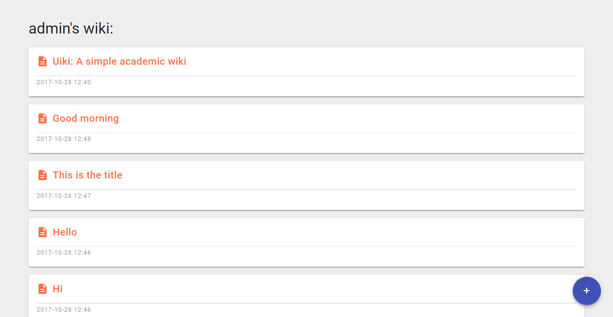
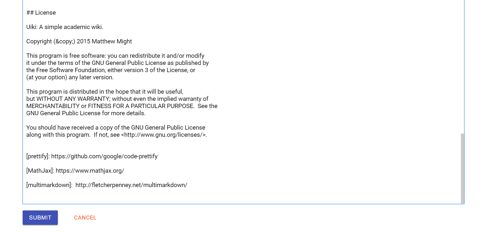

# Uiki: A simple academic wiki

Uiki (wee-kee) is a simple academic wiki which supports:

  + [MathJax] for LaTeX formatting
  + [multimarkdown] for markdown formatting
  + git for page versioning/offline editing
  + [prettify] for syntax highlighting
  + `htpasswd`-style files for user authentication
  + SSL-encrypted connections

To enable remote checkouts/editing and to avoid the 
risk of losing data due to upgrades, all uiki pages are stored 
in (markdown-formatted) plaintext.

For a user `<user>` and a page `<name>`, the content for that page will be (by default) in:

    db/<user>/<name>/content.md

which is also easily editable by a text editor on the server.

This program serves as the motivation for my article on 
[web programming in Racket](http://matt.might.net/articles/low-level-web-in-racket/).


## Dependencies

 + racket
 + git
 + multimarkdown
 + htpasswd (bundled with Apache)
 + openssl (if generating a key and cert)


## Installation

There is no installation.  Uiki runs in place.


## Running

To run uiki, use:

    make run

or directly with:

    racket uiki.rkt

After you start it, set your browser to:

    http://localhost:1234/wiki/


## Configuration

Configuration parameters are in `config.rkt`.

By default, authentication is on, but SSL is off.

To generate `config.rkt`, run `make config.rkt`.

The first time the server runs, it will create a `passwd`
file and ask you to create an `admin` account.


## Adding users

You can add users with `htpasswd` by modifying `passwd`,
but users must use SHA1-hashed passwords.

For example, in the application directory:

    htpasswd -s passwd john


## Enabling SSL

Run `make certs` to generate a private key and a self-signed 
certificate in the directory `certs`.

Then, modify the approriate entries in `global.rkt` to point 
to these, and set `use-ssl?` to `#t`.


## Wiki syntax

You can link to new pages by enclosing their name in `[[` and `]]`.

You can use the pipe `[[target|text]]` notation to redirect a 
within-wiki link.


## Markdown syntax

Markdown syntax is supported by [multimarkdown].


## LaTeX syntax

Inline LaTeX syntax is supported with `$`-notation, as in `$f(x)$`.

Equation blocks are supported by surrounding LaTeX with `\\[` and `\\]`,
as in:

```
\\[
 Z = \int_0^\infty g(x)d(x)
\\]
```


## Syntax highlighting

You can render code with syntax highlighting in 
a fenced block by specifying the language, as in:

    ```javascript
    function main () {
       printf("Running some code.")
    }
    ```

## Screenshot

list page:



view page:


edit page:



## License

Uiki: A simple academic wiki.

Copyright (&copy;) 2015 Matthew Might

This program is free software: you can redistribute it and/or modify
it under the terms of the GNU General Public License as published by
the Free Software Foundation, either version 3 of the License, or
(at your option) any later version.

This program is distributed in the hope that it will be useful,
but WITHOUT ANY WARRANTY; without even the implied warranty of
MERCHANTABILITY or FITNESS FOR A PARTICULAR PURPOSE.  See the
GNU General Public License for more details.

You should have received a copy of the GNU General Public License
along with this program.  If not, see <http://www.gnu.org/licenses/>.


[prettify]: https://github.com/google/code-prettify

[MathJax]: https://www.mathjax.org/

[multimarkdown]:  http://fletcherpenney.net/multimarkdown/

